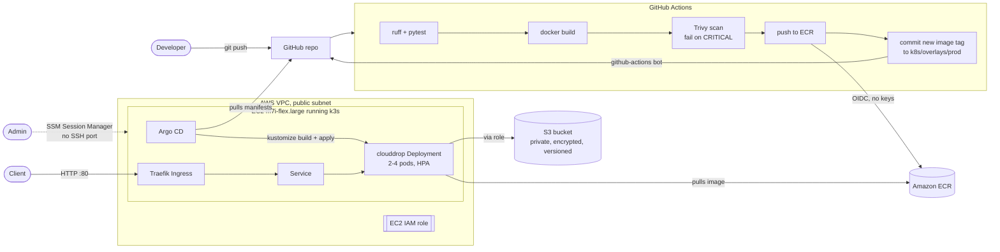

# CloudDrop

[](https://github.com/Lucas-Meira22/CloudDrop/actions/workflows/ci.yaml)

A small file-sharing API, and everything around it that a production service needs: infrastructure as code, a container pipeline with a security gate, Kubernetes, and GitOps.

The app itself is intentionally simple: upload a file, list files, get a temporary download link. The point of the project is the platform: **a `git push` turns into a tested, scanned image that Argo CD deploys to Kubernetes on AWS, with no access keys stored anywhere and no one running `kubectl`.**

---

## Contents

- [What it does](#what-it-does)
- [Architecture](#architecture)
- [Tech stack](#tech-stack)
- [How a change reaches production](#how-a-change-reaches-production)
- [Security decisions](#security-decisions)
- [Repository layout](#repository-layout)
- [Run it locally](#run-it-locally)
- [Deploy it to AWS](#deploy-it-to-aws)
- [Test it](#test-it)
- [Cost](#cost)
- [What I learned](#what-i-learned)
- [Status and next steps](#status-and-next-steps)

---

## What it does

A REST API built with FastAPI. Files are stored in a private, encrypted S3 bucket.

| Method | Path | Description | Public via Ingress |
|---|---|---|---|
| `POST` | `/files` | Upload a file (multipart form field `file`) | ✅ |
| `GET` | `/files` | List stored files | ✅ |
| `GET` | `/files/{name}` | Get a **pre-signed S3 URL** that downloads the file for 5 minutes. `404` if it doesn't exist | ✅ |
| `GET` | `/healthz` | Liveness probe: the process is up | ✅ |
| `GET` | `/readyz` | Readiness probe: the bucket is configured and reachable (`503` otherwise) | ❌ cluster only |
| `GET` | `/metrics` | Prometheus metrics (request count, latency, and so on) | ❌ cluster only |

The bucket is never public. Downloads use **pre-signed URLs**: links signed with the app's IAM role credentials that expire after 300 seconds. The app checks that the object exists *before* signing, so it never hands out a link that only fails when clicked.

The app reaches S3 through the **EC2 instance's IAM role**. There are no AWS access keys in the code, the image, Kubernetes or GitHub.

---

## Architecture



Everything in AWS is created by **Terraform**, with remote state in S3 and native S3 state locking.

---

## Tech stack

| Area | Tools | Where |
|---|---|---|
| App | Python 3.14, FastAPI, boto3, Uvicorn | [`app/`](app/) |
| Tests and lint | pytest, moto (fake AWS), ruff, uv | [`app/tests/`](app/tests/) |
| Container | Docker multi-stage build, non-root user, `HEALTHCHECK` | [`Dockerfile`](Dockerfile) |
| Cloud | AWS: VPC, EC2, S3, ECR, IAM, SSM, Budgets | [`infra/`](infra/) |
| Infrastructure as code | Terraform (AWS provider 6.x), S3 backend with lockfile | [`infra/`](infra/) |
| Kubernetes | k3s, Kustomize (base + prod overlay), Traefik Ingress, HPA | [`k8s/`](k8s/) |
| CI/CD | GitHub Actions, GitHub OIDC → AWS, Trivy | [`.github/workflows/ci.yaml`](.github/workflows/ci.yaml) |
| GitOps | Argo CD (Helm chart), auto-sync + prune + self-heal | [`argocd/`](argocd/) |
| Observability | Prometheus metrics endpoint, local Prometheus via Compose | [`prometheus.yml`](prometheus.yml) |

---

## How a change reaches production

1. A developer pushes to `main` (a change under `app/`, the `Dockerfile` or the workflow).
2. **GitHub Actions**, [`ci.yaml`](.github/workflows/ci.yaml):
   - **Lint and test:** `ruff check`, `ruff format --check`, `pytest`.
   - **Build and scan:** `docker build`, then **Trivy** fails the job on any fixable CRITICAL vulnerability.
   - **Push:** assumes an AWS IAM role through **GitHub OIDC** (short-lived credentials, no secrets stored) and pushes the image to ECR, tagged with the commit SHA.
   - **Bump tag:** `kustomize edit set image` writes the new SHA into [`k8s/overlays/prod/kustomization.yaml`](k8s/overlays/prod/kustomization.yaml), and `github-actions[bot]` commits it back to `main`.
3. **Argo CD**, running inside the cluster, sees the new commit and syncs the prod overlay. Kubernetes rolls out pods with the new image.

CI **never** has access to the cluster. It only writes to Git and ECR, and the cluster pulls from both. Git is the single source of truth for what runs in production.

Pull requests run lint, tests, build and scan, but never push images or write to `main`.

---

## Security decisions

| Decision | Why |
|---|---|
| **No SSH, port 22 closed.** Admin access through SSM Session Manager | No keys to leak, no open port to scan. Every session is authenticated with IAM and logged |
| **IAM roles everywhere, no access keys** | The EC2 role gives the app S3 access. GitHub OIDC gives CI ECR access. Nothing long-lived to steal |
| **Least-privilege policies** | The app can only `List/Get/Put` on its own bucket. CI can only push to its own ECR repo. The node can only *pull* from ECR |
| **OIDC trust pinned to `main` with immutable IDs** | The role trusts `repo:Lucas-Meira22@<owner-id>/CloudDrop@<repo-id>:ref:refs/heads/main`. PRs, forks, other branches, and a re-created repo with the same name cannot assume it |
| **Per-job workflow permissions** | Repo-wide default is `contents: read`. Only the tag-bump job gets `contents: write`, separate from the job that holds AWS credentials and runs third-party actions |
| **Security-sensitive actions pinned to commit SHAs** (Trivy, AWS credentials, ECR login) | A moved tag can't swap the code that handles credentials or decides what passes the scan |
| **Trivy gate** | Images with fixable CRITICAL CVEs never reach ECR |
| **ECR tags are immutable** | A tag (commit SHA) always points to the same image |
| **Hardened pods** | Non-root UID 10001, read-only root filesystem, all Linux capabilities dropped, no privilege escalation, seccomp `RuntimeDefault`, no service account token |
| **Pod Security Admission `restricted`** | The namespace rejects any pod that breaks the rules above |
| **Private, encrypted, versioned S3** | Block Public Access on, SSE-S3, versioning, lifecycle expiry after 30 days |
| **IMDSv2 required** | Blocks SSRF-style theft of instance credentials |
| **Budget alert as code** | Emails at 85% and 100% of US$10/month, including forecasts, with credits excluded so real usage is visible |

---

## Repository layout

```
.
├── app/                     FastAPI app, tests, uv project (pyproject.toml, uv.lock)
├── Dockerfile               Multi-stage build, non-root, healthcheck
├── docker-compose.yaml      Local run: app + Prometheus
├── prometheus.yml           Local Prometheus scrape config
├── infra/                   Terraform: VPC, EC2 + k3s bootstrap, IAM, S3, ECR, GitHub OIDC, budget
│   └── user_data.sh         First boot: installs k3s and a systemd timer that refreshes the ECR pull secret
├── k8s/
│   ├── base/                Namespace, Deployment, Service, Ingress, HPA, ConfigMap
│   └── overlays/prod/       Prod bucket name + image tag (updated by CI)
├── argocd/
│   ├── values.yaml          Helm values for Argo CD, trimmed for a single node
│   └── application.yaml     Argo CD Application: watches k8s/overlays/prod on main
└── .github/workflows/ci.yaml
```

---

## Run it locally

### Prerequisites
- [uv](https://docs.astral.sh/uv/) (Python 3.14 is installed by uv if missing)
- Docker (for the container and Compose)

### Tests and lint, no AWS needed

```bash
cd app
uv sync --locked
uv run ruff check .
uv run ruff format --check .
uv run pytest
```

The tests use **moto** to fake S3 in memory, and set fake credentials, so they can never touch a real AWS account.

### Run the container with Prometheus

```bash
docker compose up --build
```

| URL | What |
|---|---|
| http://localhost:8000/healthz | Liveness, returns `{"status":"ok"}` |
| http://localhost:8000/docs | Interactive API docs (Swagger UI) |
| http://localhost:8000/metrics | Raw Prometheus metrics |
| http://localhost:9090 | Prometheus. Try the query `http_requests_total` |

> The container has no AWS credentials locally, so `/healthz`, `/docs` and `/metrics` work, but the S3 routes return `502` and `/readyz` returns `503`. Point `BUCKET_NAME` at a real bucket and pass AWS credentials into the container to use them.

---

## Deploy it to AWS

> **Heads-up:** this creates billable resources. See [Cost](#cost), and run `terraform destroy` when you're done.

### Prerequisites
- An AWS account and the AWS CLI, signed in (`aws login` or `aws configure`)
- The [Session Manager plugin](https://docs.aws.amazon.com/systems-manager/latest/userguide/session-manager-working-with-install-plugin.html) for the AWS CLI
- Terraform ≥ 1.10 (for S3-native state locking)

### Using your own account or fork
Several values are specific to the original account and repo. Change them first:

| File | Value |
|---|---|
| `infra/backend.tf` | State bucket name |
| `infra/budget.tf` | `billing_view_arn` (account ID) |
| `infra/github_oidc.tf` | `sub` claim: your `owner@id/repo@id`. Get it from `GET /repos/{owner}/{repo}/actions/oidc/customization/sub` |
| `.github/workflows/ci.yaml` | `role-to-assume` ARN (account ID) |
| `k8s/base/deployment.yaml`, `k8s/overlays/prod/kustomization.yaml` | ECR image URL and bucket name (account ID) |
| `argocd/application.yaml` | `repoURL` |

### 1. Create the Terraform state bucket (once, by hand)
The S3 backend must exist before Terraform can use it. Create a bucket with versioning, encryption and Block Public Access, and put its name in `infra/backend.tf`.

### 2. Provision the infrastructure

```bash
cd infra
cp terraform.tfvars.example terraform.tfvars   # set budget_email
terraform init
terraform plan
terraform apply
terraform output
```

This creates the VPC, the EC2 instance (which installs k3s on first boot), the S3 bucket, the ECR repository, IAM roles, the GitHub OIDC provider and the budget. The first boot takes about 2 minutes.

### 3. Connect to the node (no SSH)

```bash
aws ssm start-session --target $(terraform output -raw instance_id) --region us-east-1
sudo -i
export KUBECONFIG=/etc/rancher/k3s/k3s.yaml
kubectl get nodes
```

> Run everything as root (`sudo -i`) and don't prefix commands with `sudo` afterwards. `sudo` drops `KUBECONFIG`, and `kubectl`/`helm` then fail with `localhost:8080 connection refused`.

### 4. Install Argo CD

```bash
snap install helm --classic
helm repo add argo https://argoproj.github.io/argo-helm
helm repo update
helm install argocd argo/argo-cd \
  --version 10.9.6 \
  --namespace argocd --create-namespace \
  -f https://raw.githubusercontent.com/Lucas-Meira22/CloudDrop/main/argocd/values.yaml \
  --wait --timeout 10m
```

### 5. Make sure the image exists in ECR
After a fresh `terraform apply`, the ECR repository is empty. Push a change under `app/`, or re-run the latest CI workflow, so the tag in the prod overlay exists before Argo CD deploys it. Otherwise the pods sit in `ImagePullBackOff`.

### 6. Hand the app to Argo CD

```bash
kubectl apply -f https://raw.githubusercontent.com/Lucas-Meira22/CloudDrop/main/argocd/application.yaml
kubectl get applications -n argocd -w     # wait for Synced / Healthy
kubectl get pods -n clouddrop
```

From here on, every push to `main` deploys itself.

### 7. Open the Argo CD UI (optional)

On the node, get the admin password and the service's ClusterIP:

```bash
kubectl -n argocd get secret argocd-initial-admin-secret -o jsonpath="{.data.password}" | base64 -d; echo
kubectl get svc argocd-server -n argocd
```

On your machine, open an SSM tunnel to it (no inbound port is opened):

```bash
aws ssm start-session --target <instance-id> --region us-east-1 \
  --document-name AWS-StartPortForwardingSessionToRemoteHost \
  --parameters 'host=<argocd-server-cluster-ip>,portNumber=443,localPortNumber=8443'
```

Then browse to https://localhost:8443 and log in as `admin`.

### 8. Tear it down

```bash
cd infra
terraform destroy
```

This removes everything, including the S3 bucket's files and the ECR images (`force_destroy` / `force_delete`). The Terraform state bucket is not managed by Terraform, so it stays.

---

## Test it

### On AWS

```bash
IP=$(terraform -chdir=infra output -raw public_ip)

# Health
curl http://$IP/healthz                                   # {"status":"ok"}

# Upload, list, download
echo "hello cloud" > test.txt
curl -F file=@test.txt http://$IP/files                   # {"filename":"test.txt"}
curl http://$IP/files                                     # {"files":["test.txt"]}
curl http://$IP/files/test.txt                            # {"url":"https://...X-Amz-Signature=..."}
curl "$(curl -s http://$IP/files/test.txt | jq -r .url)"  # hello cloud
curl -i http://$IP/files/nope.txt                         # 404

# The file really is in S3
aws s3 ls s3://$(terraform -chdir=infra output -raw bucket_name)
```

### Autoscaling (HPA)
Generate load with [`hey`](https://github.com/rakyll/hey) and watch the HPA scale from 2 to 4 pods:

```bash
hey -z 2m -c 50 http://$IP/files                # from your machine
kubectl get hpa -n clouddrop -w                 # on the node
```

### GitOps
- **Deploy by pushing:** change something under `app/` and push. Watch the Actions run, the bot's `chore: bump clouddrop image to <sha>` commit, then `kubectl get pods -n clouddrop` switching to the new image.
- **Self-heal:** run `kubectl delete deployment clouddrop -n clouddrop`. Argo CD recreates it within seconds, because Git says it should exist.
- **Drift detection:** run `kubectl edit` on any managed resource. Argo CD reverts the change to match Git.

### Check the cluster's state

```bash
kubectl get applications -n argocd
kubectl get all -n clouddrop
kubectl top pods -n clouddrop
```

---

## Cost

Approximate on-demand prices in us-east-1:

| Resource | Price |
|---|---|
| EC2 `m7i-flex.large` (2 vCPU, 8 GB) | ~US$0.096/hour, about US$2.30/day |
| EBS gp3, 20 GB | ~US$1.60/month |
| Public IPv4 address | ~US$0.005/hour |
| S3, ECR, SSM, data transfer | Cents at this scale |

A weekend (48 h) costs about **US$5**. On an AWS Free plan account it's paid from the account's credits. The budget alert emails before US$10/month is reached. **Run `terraform destroy` when you stop:** the portfolio is this repository, not a server that's always on.

---

## What I learned

Real problems hit while building this, and how they were solved:

- **GitHub's OIDC subject claim changed shape.** CI failed with `Not authorized to perform sts:AssumeRoleWithWebIdentity`. The repo uses GitHub's *immutable* subject format, which includes numeric owner and repo IDs (`repo:owner@id/repo@id:...`). The trust policy matched the old name-only format. Matching the IDs fixed it, and it also protects against "repojacking": a deleted repo being re-created under the same name.
- **A 2 GB node with no swap froze while installing Argo CD.** Five pods starting at once used up the remaining ~600 MB, and the kernel started thrashing (SSM stopped responding, CPU hit 80%). I diagnosed it from outside with CloudWatch metrics and SSM ping status, and right-sized the node in Terraform. t3.medium is blocked on AWS Free plan accounts (`FreeTierRestrictionError`), so I queried `DescribeInstanceTypes` for free-tier-eligible x86 types and chose m7i-flex.large (8 GB). Argo CD itself uses only about 125 MB at idle; it was the startup burst that broke the 2 GB node.
- **A Helm install interrupted mid-`--wait` stays in `pending-install`**, and Helm then refuses any upgrade. The fix is `helm uninstall` and a clean reinstall.
- **GitOps restores manifests, not artifacts.** After a `terraform destroy`/`apply`, Argo CD correctly synced Git, but the pods failed with `ImagePullBackOff: not found`, because `force_delete` had emptied ECR. The rebuild order matters: infrastructure, then CI rebuilds the image, then GitOps deploys it.
- **HPA vs. self-heal.** The Deployment deliberately has no `replicas:` field. Otherwise Argo CD's self-heal and the HPA would fight over the replica count forever.
- **`kustomize edit` reformats files.** The first bot commit re-indented the overlay. Adopting kustomize's formatting keeps every later bump a one-line diff.
- **ECR tokens expire after 12 hours.** A systemd timer on the node refreshes the image pull secret every 6 hours using the instance role.
- **Small things that break real pipelines:** a file saved as UTF-16 by Windows PowerShell (YAML tools reject it), `sudo` dropping environment variables, and a double space that `ruff format --check` rejects in CI.

---

## Status and next steps

- [x] App with tests, metrics and probes
- [x] Docker image: multi-stage, non-root
- [x] Terraform: VPC, EC2/k3s, S3, ECR, IAM, budget, remote state
- [x] Kubernetes manifests with Kustomize, Ingress and HPA
- [x] CI/CD: lint, test, build, Trivy, OIDC push to ECR, GitOps tag bump
- [x] GitOps with Argo CD: auto-sync, prune, self-heal
- [ ] Observability on the cluster: kube-prometheus-stack, ServiceMonitor, Grafana dashboard
- [ ] Architecture diagram image and screenshots (Argo CD, Grafana)

Ideas beyond the plan:
- `lifecycle { ignore_changes = [ami] }` on the instance, so a newer Ubuntu AMI can't trigger a replacement on a routine `apply`
- Have Argo CD manage its own installation (app-of-apps pattern)
- HTTPS with cert-manager and Let's Encrypt
- `tflint` / `checkov` in CI
- ECR credential provider for the kubelet instead of the refresh timer
- NetworkPolicy and PodDisruptionBudget
- Run the same manifests on EKS to show portability
